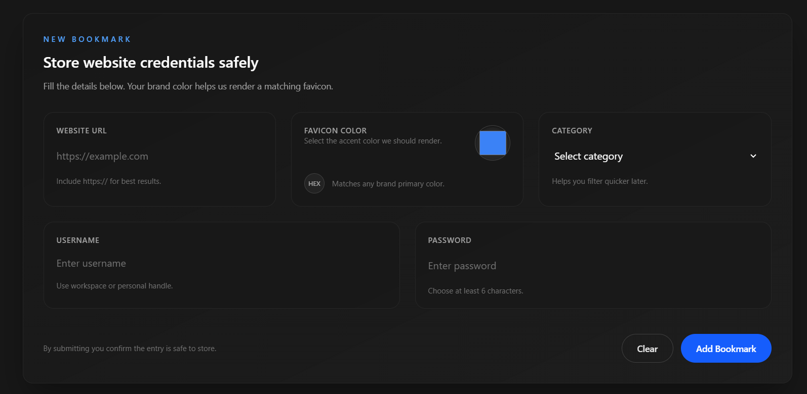
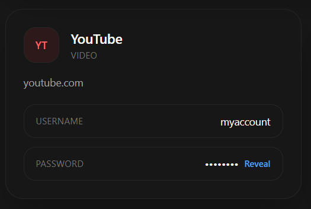

# 🔐 Vault - Manager

<div align="center">


### 🛡️ Secure & User-Friendly Password Management

Vault-Manager is a modern password manager built with **React** and **Tailwind CSS**, allowing you to safely store, organize, and access your passwords with ease.

[](https://batch-4-assignment-2-vault-manager.vercel.app/)
[](https://github.com/AfsanaMim9639/batch-4-assignment-2-vault-manager.git)

</div>


---

## 📸 Screenshots

<div align="center">

### Form

*Easy-to-use form to add new credentials*

### Card with password toggle

*Show/hide passwords feature*

### 🔍 Search & Filter

*Quickly find any password with real-time search*

</div>


---

## 🌟 What is Vault-Manager?

Vault-Manager is a **modern and secure password manager** designed to help you:

-  **Store Credentials:** Save website login information safely
-  **Search & Find Quickly:** Instantly locate any password
-  **Organize by Categories:** Social, Video, Music, etc.
-  **Colorful Icons:** Easily identify websites
-  **Show/Hide Passwords:** Reveal only when needed

**Ideal for:** Students, developers, or anyone who wants to manage passwords efficiently and securely.
---

## ✨ Key Features

| Feature | Description |
|---------|-------------|
|  **Easy Storage** | Save website URL, username, and password securely |
|  **Colorful Icons** | Each website gets a unique colored icon for easy identification |
|  **Quick Search** | Instantly find any password |
|  **Smart Sorting** | Sort passwords by name or date added |
|  **Password Toggle** | Show or hide passwords with a single click |
|  **Mobile Friendly** | Fully responsive for phones and tablets |
|  **Categories** | Organize passwords by Social, Video, Music, etc. |
|  **Fast & Light** | Super fast loading and smooth performance |

---

## 🛠️ Built With

<div align="center">

| Technology | Purpose |
|------------|---------|
| ⚛️ **React.js** | For building the user interface |
| 🎨 **Tailwind CSS** | For beautiful styling |
| ⚡ **Vite** | For fast development |
| 📦 **LocalStorage** | For storing data in browser |

</div>

---

## 🚀 How to Use This Project

### Option 1: View Live Demo 🌐
[Simply click the live demo link above to use the app right away!](https://batch-4-assignment-2-vault-manager.vercel.app/)

### Option 2: Run on Your Computer 💻

**Step 1: Download the Code**
```bash
# Clone this repository
git clone https://github.com/AfsanaMim9639/batch-4-assignment-2-vault-manager.git

# Go to project folder
cd assignment-2
```

**Step 2: Install Dependencies**
```bash
npm install
```

**Step 3: Start the Application**
```bash
npm run dev
```

**Step 4: Open in Browser**
```
Open: http://localhost:5173
```

That's it! 🎉 Your vault manager is now running!

---

## 📖 How to Use Vault-Manager

### 1️⃣ **Add a New Password**

1. Click the **"Add New Password"** button on the dashboard.
2. Fill in the details:
   - 🌐 **Website URL** (e.g., `https://example.com`)
   - 🎨 **Pick an icon color** for easy identification
   - 📂 **Select a category** (Social, Video, Music, etc.)
   - 👤 **Username** for the website
   - 🔒 **Password** for the website
3. Click **"Add Bookmark"** to save the credentials securely.

### 2️⃣ **Search for a Password**

- Use the **search bar** at the top to quickly locate any saved password.
- Results appear **instantly as you type**.

### 3️⃣ **Sort Your Passwords**

- Click the **"Sort By"** dropdown to organize passwords:
  - 📝 **By Name:** A → Z or Z → A
  - 📅 **By Date Added:** Newest → Oldest or Oldest → Newest

### 4️⃣ **Reveal or Hide Passwords**

- Click the **"Reveal"** button to view the password.
- Click **"Hide"** to keep it hidden for security.

### 5️⃣ **Mobile Friendly**

- Vault-Manager is fully responsive and works seamlessly on **phones and tablets**.

## 📂 Project Structure

```
password-manager/   
│    
│
├── src/                     # Source code
│   ├── components/          # React components
│   │   ├── BookmarkForm.jsx     # Add password form
│   │   ├── PasswordCard.jsx     # Password display card
│   │   ├── SearchBar.jsx        # Search functionality
│   │   └── SortDropdown.jsx     # Sort options
│   │
│   ├── App.jsx              # Main app component
│   └── main.jsx             # Entry point
|   |__pages/                #React Pages
|       |___Home.jsx
│
├── package.json             # Dependencies
└── README.md               # This file!
```

---

## 🎓 What You Can Learn from Vault-Manager

This project is an excellent way to learn and practice:

-  **React Components & State Management** – Build reusable components and manage app state effectively  
-  **Form Handling & Validation** – Create interactive forms with proper validation  
-  **Search & Filter Functionality** – Implement real-time search and sorting of data  
-  **LocalStorage for Data Persistence** – Save and retrieve user data in the browser  
-  **Responsive Design with Tailwind CSS** – Build layouts that work on desktop, tablet, and mobile  
-  **Sorting & Organizing Data** – Sort passwords by name or date and organize by categories  
-  **Toggle Password Visibility** – Show or hide passwords securely  
-  **UI/UX Best Practices** – Design intuitive, user-friendly interfaces


---

## ⚠️ Important Notes

> **🔴 Security Warning:** Vault-Manager is a learning project. All passwords are stored in your browser's **LocalStorage** and are **not encrypted**.  
>
> **⚠️ For Real Use:** Do **not** store important or sensitive passwords here. Use trusted password managers like **LastPass**, **1Password**, or **Bitwarden** for real-world security.

---

## 🎯 Future Improvements

Here are some ideas to enhance Vault-Manager in the future:

- [ ] 🔐 **Password Encryption** – Encrypt stored passwords for added security  
- [ ] 🔑 **Master Password Login** – Add a master password to access the vault  
- [ ] 📤 **Export Passwords** – Download your saved passwords securely  
- [ ] 📥 **Import Passwords** – Import from CSV or JSON files  
- [ ] ✏️ **Edit Existing Entries** – Update credentials as needed  
- [ ] 🗑️ **Delete Passwords** – Remove unwanted entries  
- [ ] 💪 **Password Strength Indicator** – Warn weak passwords  
- [ ] 🎲 **Random Password Generator** – Generate secure passwords automatically  
- [ ] 🌙 **Dark/Light Theme Toggle** – Switch between light and dark modes  
- [ ] ☁️ **Cloud Sync** – Sync passwords across devices with a backend  

---

## 📝 Assignment Submission Checklist

Before submitting, make sure your Vault-Manager project meets the following:

- [ ] ✅ Project runs without errors  
- [ ] ✅ All core features are functional  
- [ ] ✅ Code is clean, organized, and commented  
- [ ] ✅ Responsive design implemented  
- [ ] ✅ Search and sorting functionality working  
- [ ] ✅ Password show/hide toggle working  
- [ ] ✅ Form validation added  
- [ ] ✅ Screenshots and GIFs included  
- [ ] ✅ README is complete and polished


---


<div align="center">

**[⬆ Back to Top](#-securevault---password-manager)**

</div>